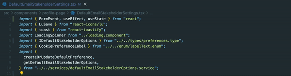

  

# structured-ladder-imports README

We invest considerable effort to perfect our code, so let's also streamline our imports for clarity and organization.

## Features

This extension optimizes your import statements by:

1. **Categorizing Imports:** Separates imports into two groups: module imports (from node_modules) and local imports (from within the project).
2. **Sorting and Reorganizing:** Arranges imports within each category and replaces the existing import statements.

Supports multiline import statements for comprehensive organization.

  

## Known Issues

Primarily tested within a React Project, this extension is designed to function across various environments. However, note that multiline imports might behave unexpectedly outside.

## Release Notes

### 1.0.0

Initial release of the extension

## Future Improvements

- Integration with a prettier plugin could significantly streamline the process.

---
